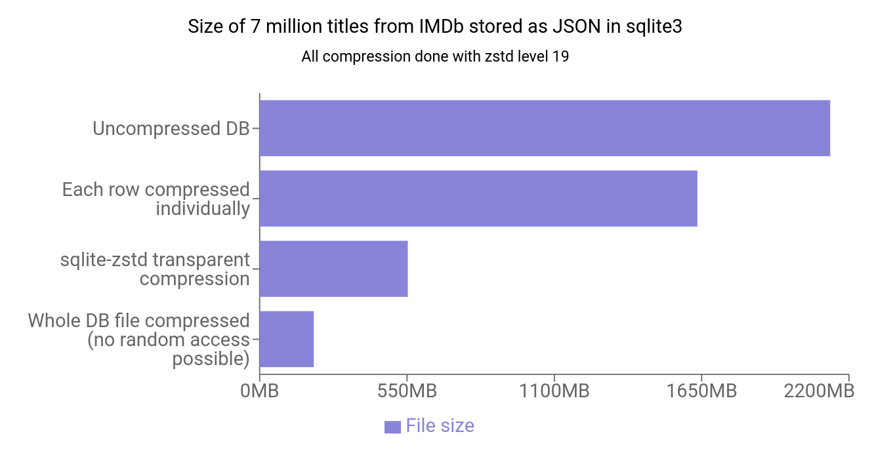

# sqlite-zstd

Extension for sqlite that provides transparent dictionary-based row-level compression for sqlite. This basically allows you to compress entries in a sqlite database almost as well as if you were compressing the whole DB file, but while retaining random access.

See also the announcement blog post for some motivation, benchmarks and ramblings: https://phiresky.github.io/blog/2022/sqlite-zstd

[](https://phiresky.github.io/blog/2022/sqlite-zstd)

Depending on the data, this can reduce the size of the database by 80% while keeping performance mostly the same (or even improving it, since the data to be read from disk is smaller).

Note that a compression VFS such as https://github.com/mlin/sqlite_zstd_vfs might be suited better depending on the use case. That has very different tradeoffs and capabilities, but the end result is similar.

## Transparent Compression

- `zstd_enable_transparent(config)`

  Enable transparent row-level compression of the given column on the given table.

  You can call this function several times on the same table with different columns to compress.

  ```sql
      SELECT
          zstd_enable_transparent('{"table": "objects", "column": "data1", "compression_level": 19, "dict_chooser": "''a''"}'),
          zstd_enable_transparent('{"table": "objects", "column": "data2", "compression_level": 19, "dict_chooser": "''a''"}')

  ```

  The data will be moved to `_table_name_zstd`, while `table_name` will be a view that can be queried as normally, including SELECT, INSERT, UPDATE, and DELETE queries. This function will not compress any data by itself, you need to call `zstd_incremental_maintenance` afterwards.

  `config` is a json object describing the configuration. See [TransparentCompressConfig](src/transparent.rs#L34) for detail.

  The following differences apply when compression is active:

  - The compressed column may only contain `blob` or `text` data, depending on the affinity of the declared data type (e.g. `VARCHAR(10)` is fine, but `int` is not).
  - The primary key must not be null for any row, otherwise updating may not work as expected
  - sqlite3_changes() will return 0 for modifying queries ([see here](https://sqlite.org/c3ref/changes.html)).
  - The SQLite streaming blob reading API will be somewhat useless since the blob is fully copied into memory anyways.
  - Attaching a database containing compressed tables using `ATTACH 'foo.db'` is not supported.
  - DDL statements (like ALTER TABLE and CREATE INDEX) are only partially supported

- `zstd_incremental_maintenance(duration_seconds: float | null, db_load: float) -> bool`

  Perform an incremental maintenance operation taking around the given amount of time.
  This will train dictionaries and compress data based on the grouping given in the TransparentCompressConfig.

  `duration_seconds`: If given amount of time is 0, do a single step and exit as soon as possible. If given amount of time is null, run until all pending maintenance is complete.

  `db_load`: specifies the ratio of time the db will be locked with write queries. For example: if set to 0.5, after each write operation taking 2 seconds the maintenance function will sleep for 2 seconds so other processes have time to run write operations against the database. If set to 1, the maintenance will not sleep. Note that this is only useful if you run the incremental maintenance function in a separate thread or process than your other logic. Note that both the duration and the db load are best-effort: there is no exact guarantee about the amount of time the database will stay locked at a time.

  _Returns_ 1 if there is more work to be done, 0 if everything is compressed as it should.

  Note that each call of this function has a start up time cost equivalent to `select * from table where dictid is null`, so longer durations are more efficient.

  This function can safely be interrupted at any time, each chunk of compression work is done as an atomic operation.

  Examples:

  - `zstd_incremental_maintenance(null, 1)`: Compresses everying, as fast as possible. Useful if the db is not currently in use.
  - `zstd_incremental_maintenance(60, 0.5)`: Spend 60 seconds compressing pending stuff, while allowing other queries to run 50% of the time.

  Example output:

  ```
  sqlite> select zstd_incremental_maintenance(null, 1);
    [2020-12-23T21:11:31Z WARN  sqlite_zstd::transparent] Warning: It is recommended to set `pragma busy_timeout=2000;` or higher
    [2020-12-23T21:11:40Z INFO  sqlite_zstd::transparent] events.data: Total 5.20GB to potentially compress.
    3[2020-12-23T21:13:22Z INFO  sqlite_zstd::transparent] Compressed 6730 rows with dictid=109. Total size of entries before: 163.77MB, afterwards: 2.12MB, (average: before=24.33kB, after=315B)
    [2020-12-23T21:13:43Z INFO  sqlite_zstd::transparent] Compressed 4505 rows with dictid=110. Total size of entries before: 69.28MB, afterwards: 1.60MB, (average: before=15.38kB, after=355B)
    [2020-12-23T21:14:06Z INFO  sqlite_zstd::transparent] Compressed 5228 rows with dictid=111. Total size of entries before: 91.97MB, afterwards: 1.41MB, (average: before=17.59kB, after=268B)
  ```

## Basic Functionality

- `zstd_compress(data: text|blob, level: int = 3, dictionary: blob | int | null = null, compact: bool = false) -> blob`

  Compresses the given data, with the compression level (1 - 22, default 3)

  - If dictionary is a blob it will be directly used
  - If dictionary is an int i, it is functionally equivalent to `zstd_compress(data, level, (select dict from _zstd_dict where id = i))`
  - If dictionary is not present, null, or -1, the data is compressed without a dictionary.

  if compact is true, the output will be without magic header, without checksums, and without dictids. This will save 4 bytes when not using dictionaries and 8 bytes when using dictionaries. this also means the data will not be decodeable as a normal zstd archive with the standard tools.
  The same compact argument must also be passed to the decompress function.

- `zstd_decompress(data: blob, is_text: bool, dictionary: blob | int | null = null, compact: bool = false) -> text|blob`

  Decompresses the given data. if the dictionary is wrong, the result is undefined

  - If dictionary is a blob it will be directly used
  - If dictionary is an int i, it is functionally equivalent to `zstd_decompress(data, (select dict from _zstd_dict where id = i))`.
  - If dictionary is not present, null, or -1, it is assumed the data was compressed without a dictionary.

  Note that passing dictionary as an int is recommended, since then the dictionary only has to be prepared once.

  is_text specifies whether to output the data as text or as a blob. Note that when outputting as text the encoding depends on the sqlite database encoding. sqlite-zstd is only tested with UTF-8.

  compact must be specified when the compress function was also called with compact.

- `zstd_train_dict(agg, dict_size: int, sample_count: int) -> blob`

  Aggregate function (like sum() or count()) to train a zstd dictionary on sample_count samples of the given aggregate data

  Example use: `select zstd_train_dict(tbl.data, 100000, 1000) from tbl` will return a dictionary of size 100kB trained on 1000 samples in `tbl`

  The recommended number of samples is 100x the target dictionary size. As an example, you can train a dict of 100kB with the "optimal" sample count as follows:

  ```sql
  select zstd_train_dict(data, 100000, (select (100000 * 100 / avg(length(data))) as sample_count from tbl))
                  as dict from tbl
  ```

  Note that dict_size and sample_count are assumed to be constants.

- `zstd_train_dict_and_save(agg, dict_size: int, sample_count: int, dict_chooser_key: text) -> int`

  Same as `zstd_train_dict`, but the dictionary is saved to the `_zstd_dicts` table and the id is returned.

# Compiling

This project can be built in two modes: (a) as a Rust library and (b) as a pure SQLite extension (with `--features build_extension`).

You can get the SQLite extension binaries from the GitHub releases. Alternatively, you can build the extension by hand:

```
cargo build --release --features build_extension
# should give you target/release/libsqlite_zstd.so
```

## Cross Compiling

For cross-compiling to `aarch64-linux-android`, you need to
1. Donwload the target we need to cross-compile
```bash
rustup target add aarch64_linux_android
```

2. Prepare the [Android NDK](https://developer.android.com/ndk) (The binutils is deprecated and removed from NDK 23+, so you need to download an older version of NDK)

3. Setup NDK binary path
```bash
export PATH="$PATH:<NDK_DIR>/toolchains/llvm/prebuilt/linux-x86_64/bin"
```

4. Specify linker in [cargo configuration file](https://doc.rust-lang.org/cargo/reference/config.html)
```toml
[target.aarch64-linux-android]
linker = "aarch64-linux-android23-clang"
```

5. Specify `target` accordingly when building
```bash
cargo build -r --features build_extension --target aarch64-linux-android
```

# Usage

You can either load this library as SQLite extension or as a Rust library. Note that sqlite extensions are not persistent, so you need to load it each time you connect to the database.

**Is this library production ready?**

I wouldn't trust it with my data (yet). Make sure you have backups of everything. I'm also not making any guarantees for backwards compatibility of future updates, though migrating by copying over the uncompressed data should of course work fine.

**Sqlite CLI**

Either load it in the REPL:

```sh
$ sqlite3 file.db
SQLite version 3.34.0 2020-12-01 16:14:00
sqlite> .load .../libsqlite_zstd.so
[2020-12-23T21:30:02Z INFO  sqlite_zstd::create_extension] [sqlite-zstd] initialized
sqlite>
```

Or alternatively:

`sqlite3 -cmd '.load libsqlite_zstd.so' 'select * from foo'`

**C Api**

```c
int success = sqlite3_load_extension(db, "libsqlite_zstd.so", NULL, NULL);
```

See [here](https://www.sqlite.org/loadext.html) for more information.

**Rust**

The recommended method is to add `sqlite_zstd` as a dependency to your project, then load it using

```rust
let conn: rusqlite::Connection;
sqlite_zstd::load(&conn)?;
```

Alternatively, you can load the extension like any other extension:

```rust
let conn: rusqlite::Connection;
conn.load_extension("libsqlite_zstd.so", None)?;
```

See [here](https://docs.rs/rusqlite/0.24.2/rusqlite/struct.Connection.html#method.load_extension) for more information.

# Verbosity / Debugging

You can change the log level by setting the environment variable `SQLITE_ZSTD_LOG=error` for less logging and `SQLITE_ZSTD_LOG=debug` for more logging.

# Future Work / Ideas / Todo

- investigate startup cost without dictionary
- correctly handle indices over compressed columns (try generated columns instead of views, maybe vtables, ask the sqlite devs)
- do compression in different thread(s) for performance (e.g. using .multithread(1) in zstd?)
- type affinity interferes with int pass through - `insert into compressed (col) values (1)` will result in typeof(col) = text instead of integer if the type of the column was declared as text - which in turns causes decompression to fail with "got string, but zstd compressed data is always blob"
- either change the type of the compressed column to blob or similar or disallow integer passthrough
